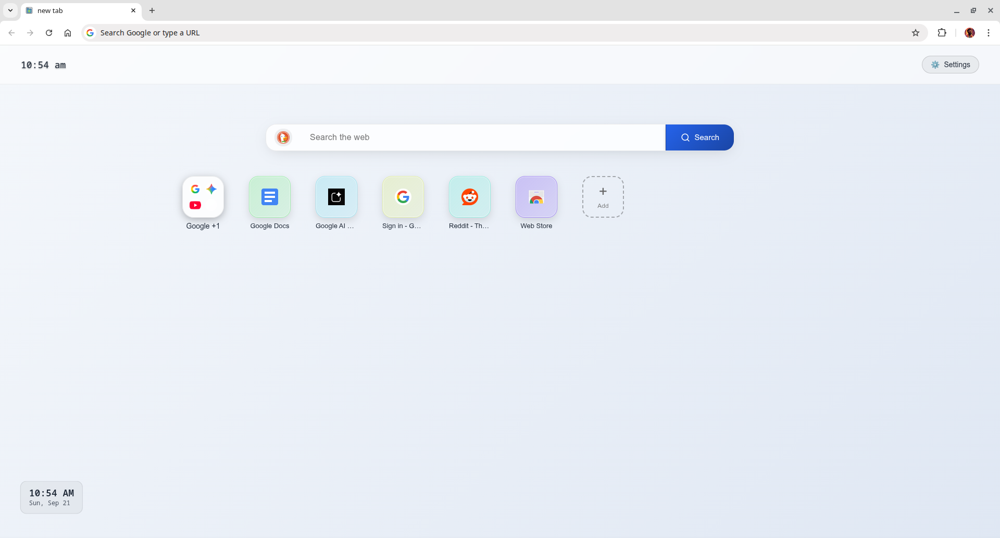

# Tilio - Android-Style New Tab Extension

Transform your Chrome new tab into an organized workspace with beautiful Android-style folders for your favorite sites and bookmarks.



## 🌟 Features

- **Android-Style Folders**: Organize your bookmarks in beautiful, intuitive folders
- **Configurable Layout**: Adjustable grid size and tile dimensions to fit your preference
- **Drag & Drop**: Easily reorganize folders and sites
- **Custom Themes**: 5 beautiful preset themes to match your style
- **Clock Widget**: Optional digital clock with customizable format
- **Import/Export**: Backup and restore your configuration
- **Offline-First**: Works completely offline with local storage
- **Lightweight**: Optimized for fast loading

## 📦 Installation

### Manual Installation (Developer Mode)
1. Download or clone this repository
2. run build.sh
2. Open Chrome and go to `chrome://extensions/`
3. Enable "Developer mode" in the top right
4. Click "Load unpacked" and select the dist folder
5. Open a new tab to see Tilio in action!

## 🚀 Quick Start

1. **Create Your First Folder**: Click the "+" button to add a new folder
2. **Add Sites**: Click on a folder to open it, then use the "+" to add sites
3. **Customize**: Click the settings (⚙️) button to personalize themes and layout
4. **Organize**: Drag and drop folders and sites to merge them together

## ⚙️ Settings & Customization

### Themes
 **Custom Themes**: 5 beautiful preset themes to match your style (when enabling a custom theme, its starting colors now clone the currently active theme instead of jumping to arbitrary defaults)
### Grid Options

### Clock Widget
- Toggle on/off
- 12-hour or 24-hour format
- Positioned in the header

## 🔧 Development

### Project Structure
```
tilio/
├── manifest.json          # Extension manifest
├── index.html             # Main new tab page
├── background.js          # Service worker
├── build.sh               # Build script
├── icons/                 # Extension icons
│   ├── favicon-32x32.png
│   ├── favicon.ico
│   ├── icon-128.png
│   ├── icon-16.png
│   ├── icon-32.png
│   ├── icon-48.png
│   └── preview.png
├── search-engines/        # Search engine icons
│   ├── bing.svg
│   ├── brave.svg
│   ├── duckduckgo.svg
│   └── google.svg
└── src/
    ├── css/
    │   ├── animations.css # Animations and transitions
    │   ├── folders.css    # Folder-specific styles
    │   ├── main.css       # Main styles
    │   └── themes.css     # Theme styles
    └── js/
        ├── app.js         # Main application
        ├── error-handler.js # Error handling
        ├── folders.js     # Folder business logic
        ├── performance.js # Performance monitoring
        ├── search.js      # Search functionality
        ├── settings.js    # Settings management
        ├── storage.js     # Chrome storage wrapper
        ├── ui.js          # UI management
        └── ui/            # UI components
            ├── ComponentManager.js
            ├── ContextMenuManager.js
            ├── DialogManager.js
            ├── DragDropManager.js
            ├── EventHandler.js
            ├── index.js
            ├── NotificationManager.js
            ├── PopoverManager.js
            ├── RenderManager.js
            └── SettingsUIManager.js
```

### Building for Production

```bash
# Run the build script
./build.sh

# The optimized files will be in the 'build' directory
# Ready for Chrome Web Store submission
```

### Development Setup

```bash
# Clone the repository
git clone https://github.com/Abmichael/tilio-extension.git
cd tilio-extension

# Load the extension in Chrome
# 1. Open chrome://extensions/
# 2. Enable Developer mode
# 3. Click "Load unpacked" and select this directory
```

## 🏗️ Technical Details

### Architecture
- **Vanilla JavaScript**: No frameworks for maximum performance
- **Modular Design**: Clear separation of concerns
- **Chrome Storage API**: Reliable local data persistence
- **CSS Grid**: Modern, responsive layout system
- **Manifest V3**: Latest Chrome extension standards

### Performance Targets
- ✅ Load time under 100ms
- ✅ Memory usage under 10MB
- ✅ 60fps animations

### Browser Support
- Chrome 88+
- Edge 88+
- Other Chromium-based browsers

## 📱 Responsive Design

X works perfectly on all screen sizes:

- **Desktop**: Full-featured experience with hover effects
- **Tablet**: Touch-optimized interactions
- **Mobile**: Compact layout with gesture support

## 🔒 Privacy & Security

- **No External Requests**: Everything runs locally
- **No Data Collection**: Your data stays on your device
- **Open Source**: Transparent code you can audit
- **Minimal Permissions**: Only requires storage permission

## 🐛 Troubleshooting

### Common Issues

**Extension doesn't load:**
- Make sure you're using Chrome 88 or newer
- Check that Developer mode is enabled
- Try reloading the extension

**Data not saving:**
- Check Chrome storage permissions
- Ensure you're not in Incognito mode
- Try clearing extension data and reimporting

**Performance issues:**
- Check if you have too many sites (recommended: <100 total)
- Try switching to a lighter theme
- Clear browser cache

## 🤝 Contributing

We welcome contributions! Please see our [Contributing Guidelines](CONTRIBUTING.md) for details.

### Development Workflow

1. Fork the repository
2. Create a feature branch: `git checkout -b feature/amazing-feature`
3. Make your changes
4. Test thoroughly
5. Submit a pull request

### Coding Standards

- Use ES6+ modern JavaScript
- Follow the existing code style
- Add comments for complex logic
- Ensure all features work offline
- Maintain the <200KB bundle size limit

## 📄 License

This project is licensed under the MIT License - see the [LICENSE](LICENSE) file for details.

## 🙏 Acknowledgments

- Inspired by Android's folder system
- Developed with support from GitHub Copilot

## 📞 Support

- 🐛 [Report Issues](https://github.com/Abmichael/tilio-extension/issues)
- 💬 [Discussions](https://github.com/Abmichael/tilio-extension/discussions)
- 📧 [Email Support](mailto:abrahammgag@gmail.com)

## 🗺️ Roadmap

- [ ] Cloud sync capabilities
- [ ] Custom icon uploads
- [ ] Bookmark import from Chrome
- [ ] Widget system for weather, notes, etc.
- [ ] Keyboard shortcuts
- [ ] Advanced search functionality

---

**Made with ❤️ by Abraham, with support from GitHub Copilot AI agent**
